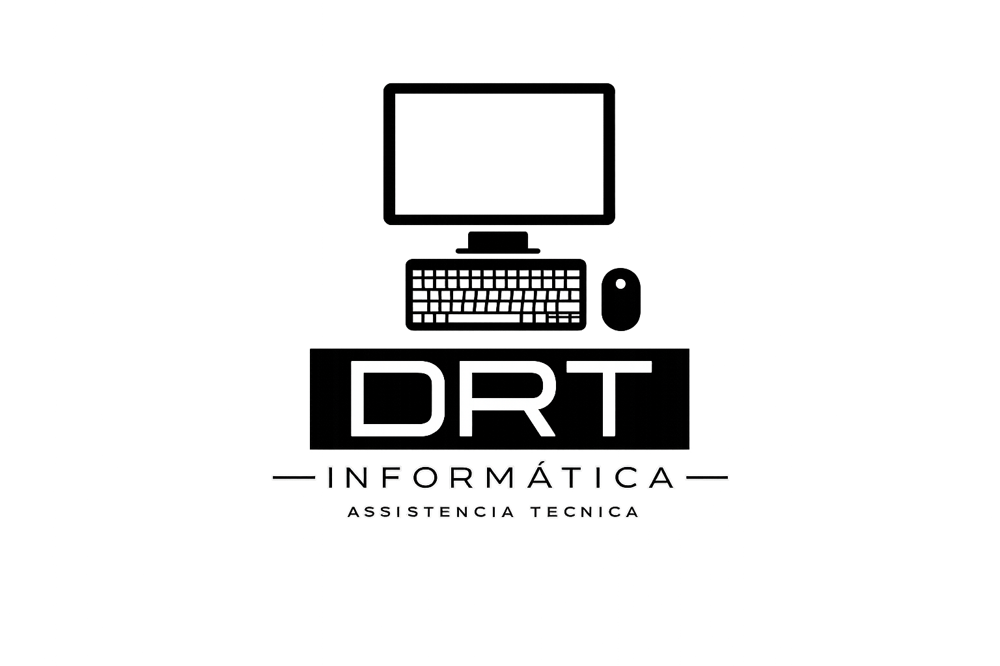

  

<h1 align="center">Sistema de Gestão DRT</h1>

Desenvolvido por <b>DRT Informática</b> 
Soluções inteligentes para empresas

# 🚀 Sistema de Gestão DRT

Sistema desenvolvido para organização de assistência técnica.

## 🔧 Funcionalidades
- Controle de Ordens de Serviço
- Orçamentos
- Vendas avulsas
- Gestão de clientes

## 💻 Tecnologias
- Next.js
- Prisma
- APIs

## 📈 Objetivo
Organizar processos e aumentar a produtividade no atendimento técnico.

## 📸 Preview do Sistema

Em breve imagens do sistema em funcionamento.

👨‍💻 Desenvolvido por
Vitor Soares 
Diego Sanches

🏢 DRT Informática  
Especialistas em soluções para empresas

📍 São Paulo - SP
